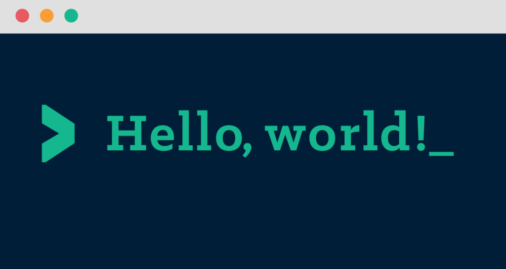

<!--s-->
# Scala fundamentals
Stefan López Romero 2019

<!--s-->

# What is Scala
<!--v-->

## History
* The design of Scala started in 2001 by [Martin Odersky](https://de.wikipedia.org/wiki/Martin_Odersky).
* Martin Odersky formerly worked on Java Generics and javac.
* Version 2.13.0 has recently been released.
* Scala 3 aka [Dotty](https://dotty.epfl.ch/) is currently under construction and will be release in 2020.

Notes: 
<!--v-->

## Features
* Java like syntax
* Supports OOP and FP from the ground up.
* Strongly typed with unified type system.
* Many features from FP languages 
* Language interoperability with Java.
* Runs on JVM

Notes: 
<!--s-->


# Getting started
<!--v-->
## Setup Scala and tools

* Install scala (2.13.0) from https://www.scala-lang.org/download/
* Install IntelliJ IDEA Scala plugin
* Clone https://github.com/debian0501/scala-fundamentals 

<!--v-->
## Try Scala REPL

REPL = Read Evaluate Print Loop
```console
stefanl@localhost ~> scala
Welcome to Scala 2.13.0 (Java HotSpot(TM) 64-Bit Server VM, Java 1.8.0_131).
Type in expressions for evaluation. Or try :help.

scala> "Hello World!"
res0: String = Hello World!

scala>
```

Notes: 
* Jede Eingabe wird sofort evaluiert
* Ergebnis kannn wiederverwendet werden
* Paste Mode mit :paste
* Multiline Expressions
* :paste + file
* :type Type einer Expression

<!--v-->

## Try IntelliJ Scala Console


 Command               | Short cut         
-----------------------|:-----------------:
evaluate code          | Cmd + Enter       
send code to console   | Ctrl + Shift + X  

Notes: 
* Im Grunde REPL nur in InteliJ integriert

<!--v-->

## Creating your First Application


Notes: 
* New Scala Object
* main: def main(args: Array[String]): Unit = {

<!--v-->
## Useful Documentation

* API Doc: https://www.scala-lang.org/api/2.13.0/index.html
* Tour of Scala: https://docs.scala-lang.org/tour/tour-of-scala.html
* Scala Cheetsheet: https://docs.scala-lang.org/cheatsheets/index.html
* Book - Essential Scala: https://underscore.io/books/essential-scala/

<!--s-->

# Scala type system

<!--v-->
## Expression vs. Statement

> An expression is a combination of one or more values, constants, variables, operators and functions that the programming language interprets and computes to produce another value.

> A statement is the smallest standalone element of an imperative programming language that expresses some action to be carried out.

<!--v-->
## Unified type system
* In Scala there are no primitive types. 
* Every type is an object
* Operators such as + and - are also methods

> Any Scala expression written **a.b(c)** can also be written **a b c**.

Note:
```scala
123.toShort // this is how we define a `Short` in Scala
// res5: Short = 123
(1).+(2) // same as 1 + 2
"the quick brown fox" split " "
```
<!--v-->

## Exercises

```scala

// 1. Rewrite in operator-style
"in scala every type is an object".split(" ")


// 2. Rewrite in method call style
43 - 3 + 2


```
<!--v-->

## Basic Types

* Scala’s _Int, Double, Boolean ..._ corresponding to Java's primitive types.
* These types are called value types.
* Strings are exactly Java’s strings, and are written the same way.
* These types are called reference types.

<!--v-->
## Nulls

```console
scala> null
res4: Null = null
```
* Null is the same as Java. 
* Scala’s _null_ also has its own type: _Null_.
* It is not possible to assign _null_ to a value type
* _null_ s are considered very bad practice in Scala

Note:
* Hierfür wird Option verwendet

<!--v-->
## Unit
```console
scala> :type ()
Unit
```
* Equivalent of Java’s _void_
* The value of Unit is written as _()_

<!--v-->

## Objects

```scala
Object NameOfObject = {
  //some declarations or expressions
}
```
* An object is a class that has exactly one instance.
* Useful for creating a class with utility methods. 
* It is created lazily when it is referenced.

Note:
* Ist ähnlich zu einer final Java classe mit static methods

<!--v-->

## Methods
```scala
Object Test {
  def name(parameter: type, ...): resultType =
    bodyExpression
  // or
  def name: resultType =
    bodyExpression
}
```
* result type is optional but it is good practice to define it as it serves as documentation.
* _return_ is implicit. There is no need to write _return_ like you would in Java.

Note:
* _name_ is the name of the method.
* the optional _parameters_ are the names given to parameters to the method.
* the _types_ are the types of the method parameters
* the optional _resultType_ is the type of the result of the method.
* the _bodyExpression_ is an expression that calling the method evaluates to.
```scala
object Test3 {
  def sayHello : String = "Hello"

  def hello(name: String) : String =
    "Hello " + name
}
```
<!--v-->
## Fields
```scala
Object Test {
  val name: type = valueExpression
  // or
  var name: type = valueExpression  
}
```
* _type_ declaration is optional. 
* _val_ defines an immutable field, meaning we cannot change the value bound to the name 
* _var_ defines an mutable field, allowing us to change the bound value.
* Always prefer _val_ to _var_.

Note: 
```console
scala> val v = 1
v: Int = 1

scala> v = 2
         ^
       error: reassignment to val
```

```console
scala> var v = 1
v: Int = 1

scala> v = 2
mutated v

scala> v
res0: Int = 2
```
<!--v-->
## Methods versus fields
```scala
object Test {
  val field = {
    println("evaluate field")
    42
  }
  def method = {
    println("evaluate method")
    42
  }
}
```
Note:
* Wieso fields wenn man auch methoden ohne parameter haben kannn
* Das object ist definiert, es wird aber noch nichts ausgeführt (lazy loading)
* Test.field:  body expression of a field is run only once
* Test.method: body of a method is evaluated every time we call the method
<!--v-->


## Exercises
* Define an object called _Math_ with a method _square_ which squares its input parameter.
* Add a method called _cube_ that cubes its input calling _square_ as part of its result calculation.

Note: 
```scala
object Math {
  
  def square(num: Double) : Double = num * num
  def cube(num: Double) : Double = square(num) * num
}
```
<!--v-->
## if Expression
```scala
if(condition)
  trueExpression
else
  falseExpression
```

* Scala’s if is an **expression**. 
* It has a type and returns a value.

Note: 
* :type if(true) "true"
* :type if(false) "true"

<!--v-->
## Blocks

```scala
{
  val hello = "Hello"
  val world = "World"
  println(hello)
  println(world)
  hello + world
}
```

* sequence of expressions or declarations
* used to produce side effects or to name intermediate results
* returns the value of the last expression

Note:
* a block is also a expression
<!--v-->

## Type hierachy


* Nothing is the type of throw expressions
* Null is the type of the value null

<!--s-->
# Objects and Classes

<!--v-->

## Classes
```scala
class Person {
  val firstName = "Donald"
  val lastName = "Duck"
  def name = firstName + " " + lastName
}
```
* Scala classes are all subclasses of _java.lang.Object_
* The default printing behaviour of Person comes from the _toString_ method defined in _java.lang.Object_.
 
Note: 
* val p = new Person
* p.firstName
* p.name

<!--v-->

## Constructors
```scala
class Person(first: String, last: String) {
  val firstName = first
  val lastName = last
  def name = firstName + " " + lastName
}
```
Or
```scala
class Person(val firstName: String, val lastName: String) {
  def name = firstName + " " + lastName
}
```
Note: 
* val immutable (only getter)
* var mutable (getter and setter)
class Person(var firstName: String, var lastName: String) {
  def name = firstName + " " + lastName
}
* p.firstName = "daisy"
* Optional: java beans @BeanProperty
* Sichtbarkeit: class Person(private val firstName: String, val lastName: String)

<!--v-->
## Default and Keyword Parameters 

This is particularly useful when creating methods and constructors with a large number of parameters.

```scala
class Person(val firstName: String = "Donald", 
             val lastName:  String = "Duck") {

  def name = firstName + " " + lastName
  
}
```

```console
scala> val p = new Person(lastName = "Trump")
p: Person = Person@4d5665bb

```

<!--v-->
## Companion Objects
```scala
class Timestamp(val seconds: Long)

object Timestamp {
  def apply(hours: Int, minutes: Int, seconds: Int): Timestamp =
    new Timestamp(hours*60*60 + minutes*60 + seconds)
}
```
```console
scala> Timestamp(1, 1, 1).seconds
res4: Long = 3661
```
* A companion object has the same name as its associated class
* Is like a Java static method.
* _apply_ gives us the ability to make the method look like a constructor.

Note:
* Scala programmers almost always prefer to implement additional constructors as apply methods on an object with the same name as the class
* Scala has two namespaces: a space of type names and a space of value names
```console
scala> :type Timestamp
Timestamp.type

scala> :type new Timestamp(1)
Timestamp`
```
<!--v-->
## Exercises
* See workspace exercise01
* Tip: you can split a String into an Array of components as follows:

```scala
val parts = "John Doe".split(" ")
// parts: Array[String] = Array(John, Doe)
parts(0)
// res3: String = John
```
<!--v-->
## Case Classes
```scala
case class Person(firstName: String, lastName: String) {
  def name = firstName + " " + lastName
}
```
* Case classes are ideal for creating lightweight data-holding classes eg. TOs.
* Scala automatically generates a class and companion object
<!--v-->

## Features of a case class
1. A field for each constructor argument
1. A default toString method 
1. Sensible equals, and hashCode methods
1. A copy method 
1. Extends the Product and Serializable traits.

Note: 
* Scala’s == operator is different from Java’s—it delegates to equals. eq stands for object identity
* The copy method let us copy an object while changing the values of one or more fields:
```scala
case class Person(firstName: String, lastName: String) {
  def name = firstName + " " + lastName
}
val p = new Person("Stefan", "López")
val pNew= p.copy(lastName="Cimander")
```
<!--v-->
## Features of a case class companion object
```scala
val p = Person("Donald", "Duck")
```
1. An apply method with the same arguments as the class constructor
1. Code to implement an extractor pattern for use in pattern matching

Note:
* There are also case objects if a class has no constructor arguments
* Better toString and extends the Product and Serializable traits

<!--v-->
## Exercises

* See workspace exercise02
<!--v-->

## Pattern Matching